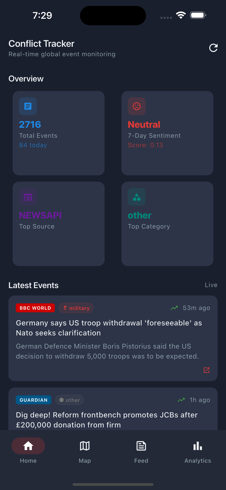
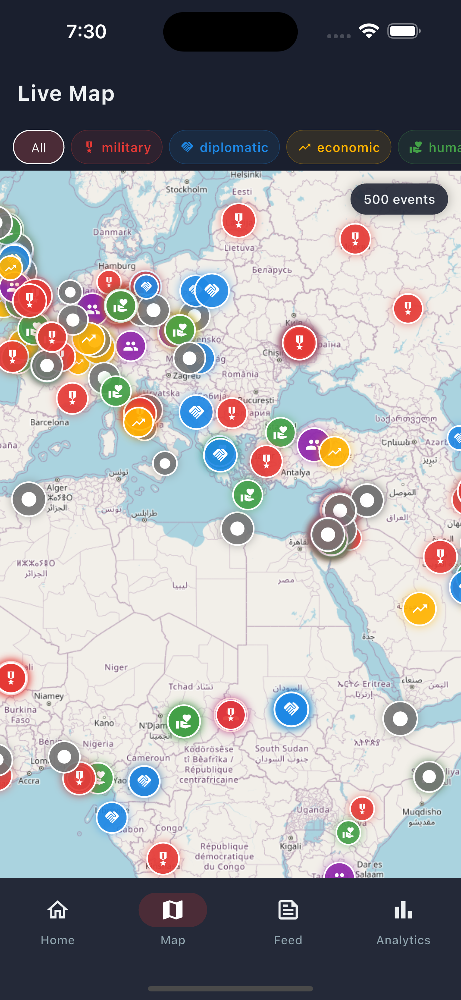
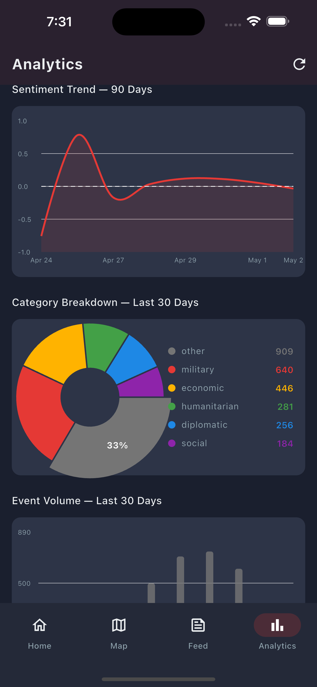

<div align="center">

<br/>


<br/><br/>

```
   ██████╗ ██████╗ ███╗   ██╗███████╗██╗     ██╗ ██████╗████████╗
  ██╔════╝██╔═══██╗████╗  ██║██╔════╝██║     ██║██╔════╝╚══██╔══╝
  ██║     ██║   ██║██╔██╗ ██║█████╗  ██║     ██║██║        ██║
  ██║     ██║   ██║██║╚██╗██║██╔══╝  ██║     ██║██║        ██║
  ╚██████╗╚██████╔╝██║ ╚████║██║     ███████╗██║╚██████╗   ██║
   ╚═════╝ ╚═════╝ ╚═╝  ╚═══╝╚═╝     ╚══════╝╚═╝ ╚═════╝   ╚═╝

  ████████╗██████╗  █████╗  ██████╗██╗  ██╗███████╗██████╗
  ╚══██╔══╝██╔══██╗██╔══██╗██╔════╝██║ ██╔╝██╔════╝██╔══██╗
     ██║   ██████╔╝███████║██║     █████╔╝ █████╗  ██████╔╝
     ██║   ██╔══██╗██╔══██║██║     ██╔═██╗ ██╔══╝  ██╔══██╗
     ██║   ██║  ██║██║  ██║╚██████╗██║  ██╗███████╗██║  ██║
     ╚═╝   ╚═╝  ╚═╝╚═╝  ╚═╝ ╚═════╝╚═╝  ╚═╝╚══════╝╚═╝  ╚═╝
```

### 🌍 Real-time global conflict event monitoring — in your pocket

<br/>

---

</div>

<br/>

## 📸 Screenshots

<div align="center">

| Home | Live Map | Analytics |
|------|----------|-----------|
|  |  |  |

</div>

<br/>

---

## ✨ What is Conflict Tracker?

**Conflict Tracker** is a Flutter mobile application that aggregates, enriches, and visualises real-time global conflict events from multiple news sources. Every article is processed through an NLP pipeline — sentiment analysis, named entity recognition, and geocoding — so you can understand *what* is happening, *where*, and *how serious* it is, all from a clean, dark-first interface.

> Built as a full-stack personal project: Flutter frontend → FastAPI backend → Python pipeline → Supabase database.

<br/>

---

## 🚀 Features

### 📰 Live News Feed
- Aggregates from **BBC, Reuters, Al Jazeera, France24, The Guardian, NewsAPI, GDELT**
- Full-text search across all events
- Filter by category: `military` `diplomatic` `economic` `humanitarian` `social`
- Pull-to-refresh with live indicator

### 🗺️ Interactive World Map
- Up to **500 geolocated events** rendered as markers
- Colour-coded by category, sized by sentiment intensity
- Tap any marker to preview the event card
- Filter by category directly on the map

### 📊 Analytics Dashboard
- **Sentiment trend** line chart — 90-day rolling average
- **Category breakdown** interactive pie chart
- **Event volume** bar chart — colour-coded by sentiment
- KPI tiles: total events, today's count, top source, top category

### 🧠 NLP Enrichment (Backend Pipeline)
- Sentiment scoring: `-1.0` (negative) → `+1.0` (positive)
- Named Entity Recognition via spaCy
- Automatic geocoding via OpenCage + hardcoded known locations
- Keyword-based category classification
- Runs every 15 minutes via GitHub Actions

<br/>

---

## 🏗️ Architecture

```
┌─────────────────────────────────────────────────────────────┐
│                     FLUTTER APP (Mobile)                     │
│  ┌──────────┐  ┌──────────┐  ┌──────────┐  ┌───────────┐   │
│  │   Home   │  │   Map    │  │   Feed   │  │ Analytics │   │
│  └────┬─────┘  └────┬─────┘  └────┬─────┘  └─────┬─────┘   │
│       └─────────────┴─────────────┴───────────────┘         │
│                    Riverpod State Layer                      │
│                    Dio HTTP Client                           │
└─────────────────────────────┬───────────────────────────────┘
                              │ HTTPS
┌─────────────────────────────▼───────────────────────────────┐
│              FASTAPI BACKEND (Render.com Free Tier)          │
│   /events   /events/map   /analytics/*   /health            │
│   Redis Caching (Upstash)  •  Rate Limiting (60/min)        │
└─────────────────────────────┬───────────────────────────────┘
                              │
┌─────────────────────────────▼───────────────────────────────┐
│                    SUPABASE (PostgreSQL)                     │
│   events  •  sentiment  •  entities  •  pipeline_runs       │
│   sentiment_daily (aggregated)                              │
└─────────────────────────────┬───────────────────────────────┘
                              │
┌─────────────────────────────▼───────────────────────────────┐
│            PYTHON PIPELINE (GitHub Actions, every 15 min)   │
│   RSS Feeds → NewsAPI → GDELT                               │
│   Clean → Deduplicate → Geocode → Categorise                │
│   Sentiment (HuggingFace) → NER (spaCy) → Write to DB      │
└─────────────────────────────────────────────────────────────┘
```

<br/>

---

## 🛠️ Tech Stack

| Layer | Technology |
|-------|-----------|
| **Mobile App** | Flutter 3.x · Dart 3.x |
| **State Management** | Riverpod 2.x |
| **Navigation** | GoRouter |
| **HTTP Client** | Dio |
| **Maps** | flutter_map + OpenStreetMap (free, no API key) |
| **Charts** | fl_chart |
| **Animations** | flutter_animate |
| **Backend** | FastAPI · Python 3.11 |
| **Database** | Supabase (PostgreSQL) |
| **Cache** | Upstash Redis |
| **NLP** | HuggingFace Inference API · spaCy en_core_web_sm |
| **Geocoding** | OpenCage Geocoding API |
| **News Sources** | RSS · NewsAPI · GDELT 2.0 |
| **Hosting** | Render.com (free tier) |
| **CI/CD** | GitHub Actions |

<br/>

---

## 📁 Project Structure

```
conflict_tracker_app/
├── lib/
│   ├── core/
│   │   ├── constants.dart        # API URL, colours, defaults
│   │   ├── router.dart           # GoRouter navigation
│   │   └── theme.dart            # Dark + Light themes
│   │
│   ├── data/
│   │   ├── models/               # EventModel, KpiModel, SentimentModel...
│   │   ├── repositories/         # EventsRepository, AnalyticsRepository
│   │   └── services/
│   │       └── api_service.dart  # Dio HTTP client, all API calls
│   │
│   ├── presentation/
│   │   ├── screens/
│   │   │   ├── splash/           # Wake-up screen with server status
│   │   │   ├── home/             # KPI grid + latest events
│   │   │   ├── map/              # Interactive world map
│   │   │   ├── feed/             # Searchable + filterable news feed
│   │   │   └── analytics/        # Charts and visualisations
│   │   └── widgets/
│   │       ├── event_card.dart   # News card + detail bottom sheet
│   │       ├── kpi_tile.dart     # Dashboard stat tile
│   │       ├── category_chip.dart
│   │       ├── sentiment_badge.dart
│   │       ├── error_view.dart
│   │       ├── empty_view.dart
│   │       └── loading_shimmer.dart
│   │
│   ├── state/
│   │   ├── analytics_provider.dart
│   │   ├── events_provider.dart
│   │   └── filter_provider.dart
│   │
│   └── main.dart
│
├── screenshots/                  # App screenshots for README
├── pubspec.yaml
└── README.md
```

<br/>

---

## ⚡ Getting Started

### Prerequisites

- Flutter SDK `>=3.0.0`
- Dart SDK `>=3.0.0`
- A running instance of the [Conflict Tracker API](https://github.com/yourusername/conflict-tracker-api)

### 1. Clone the repository

```bash
git clone https://github.com/ahmedmajid22/conflict-tracker-app.git
cd conflict-tracker-app
```

### 2. Install dependencies

```bash
flutter pub get
```

### 3. Set your API URL

Open `lib/core/constants.dart` and update the base URL:

```dart
static const String baseUrl = 'https://your-api-url.onrender.com';
```

### 4. Run the app

```bash
# iOS
flutter run -d ios

# Android
flutter run -d android

# All devices
flutter run
```

<br/>

---

## 📦 Key Dependencies

```yaml
dependencies:
  flutter_riverpod: ^2.5.1     # State management
  go_router: ^14.0.0           # Navigation
  dio: ^5.4.0                  # HTTP client
  flutter_map: ^7.0.0          # OpenStreetMap maps
  latlong2: ^0.9.0             # Lat/lon types
  fl_chart: ^0.68.0            # Charts
  flutter_animate: ^4.5.0      # Animations
  share_plus: ^9.0.0           # Share articles
  url_launcher: ^6.3.0         # Open articles in browser
  intl: ^0.19.0                # Date formatting
```

<br/>

---

## 🎨 Design System

The app uses a dark-first design with a carefully chosen colour palette:

| Token | Colour | Usage |
|-------|--------|-------|
| `primary` | `#1A1F2E` | Background |
| `surface` | `#242938` | Card surfaces |
| `accent red` | `#E53935` | Military · Negative sentiment |
| `accent blue` | `#1E88E5` | Diplomatic · Total events |
| `accent green` | `#43A047` | Humanitarian · Positive sentiment |
| `accent amber` | `#FFB300` | Economic |
| `accent purple` | `#8E24AA` | Social |

<br/>

---

## 🌐 API Endpoints Used

| Endpoint | Description |
|----------|-------------|
| `GET /health/ping` | Server liveness check (used on splash) |
| `GET /events` | Paginated event list with filters |
| `GET /events/map` | Geolocated events for map (up to 500) |
| `GET /analytics/kpi` | Dashboard KPI summary |
| `GET /analytics/sentiment-trend` | 90-day sentiment line chart data |
| `GET /analytics/category-breakdown` | Category pie chart data |
| `GET /analytics/volume` | Event volume bar chart data |

<br/>

---

## 🔄 Data Flow

```
User opens app
      │
      ▼
SplashScreen pings /health/ping
      │
      ├── Success → navigate to HomeScreen
      │
      └── Failure (3 attempts × 60s) → show error + retry button
                    │
                    ▼
            HomeScreen loads in parallel:
            ├── KPI tiles       → GET /analytics/kpi
            └── Latest events   → GET /events?limit=10

            MapScreen loads:
            └── Map markers     → GET /events/map?days=30

            FeedScreen loads:
            └── News feed       → GET /events (with filters)

            AnalyticsScreen loads in parallel:
            ├── Sentiment chart → GET /analytics/sentiment-trend
            ├── Category chart  → GET /analytics/category-breakdown
            └── Volume chart    → GET /analytics/volume
```

<br/>

---

## 📱 Supported Platforms

| Platform | Status |
|----------|--------|
| iOS | ✅ Tested on iPhone 16 Plus |
| Android | ✅ Supported |
| Web | ⚠️ Partial (map tiles may differ) |
| macOS | ⚠️ Not tested |

<br/>

---

## 🤝 Contributing

Pull requests are welcome. For major changes, please open an issue first to discuss what you would like to change.

1. Fork the repository
2. Create your feature branch: `git checkout -b feature/amazing-feature`
3. Commit your changes: `git commit -m 'feat: add amazing feature'`
4. Push to the branch: `git push origin feature/amazing-feature`
5. Open a Pull Request

<br/>

---

## 📄 License

This project is licensed under the **MIT License** — see the [LICENSE](LICENSE) file for details.

<br/>

---

<div align="center">

**Built with ❤️ using Flutter**

⭐ Star this repo if you found it useful!

<br/>

*Data sourced from BBC, Reuters, Al Jazeera, France24, The Guardian, NewsAPI, and GDELT.*
*This project is for educational purposes.*

</div>